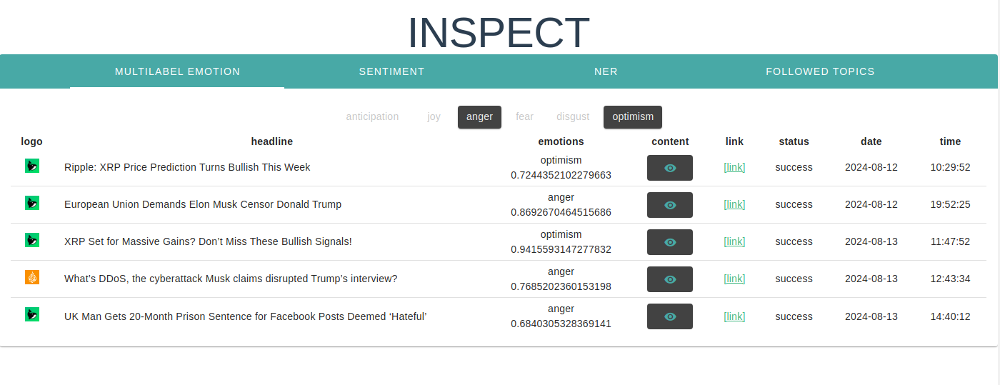
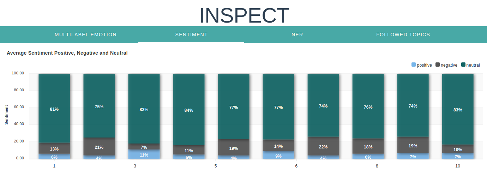
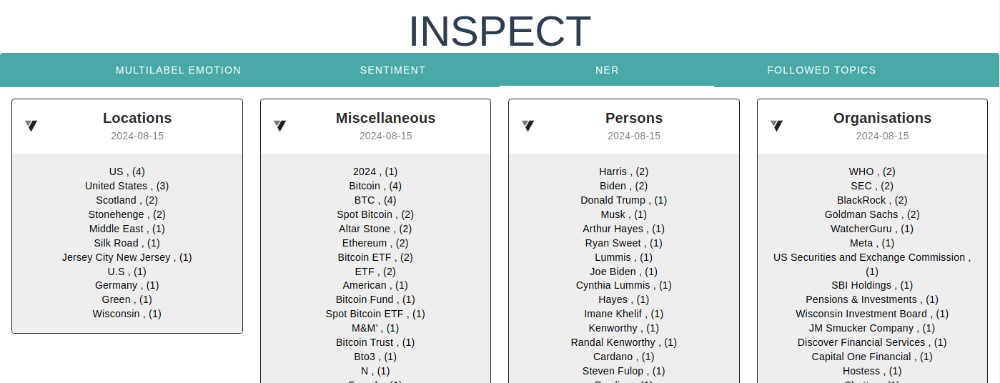
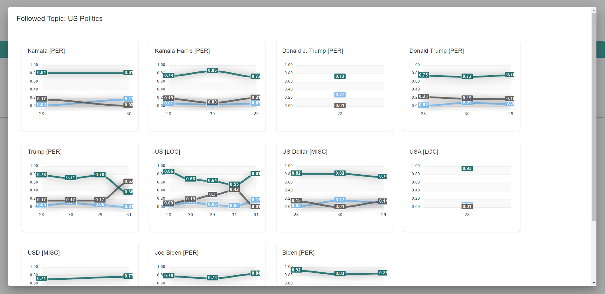
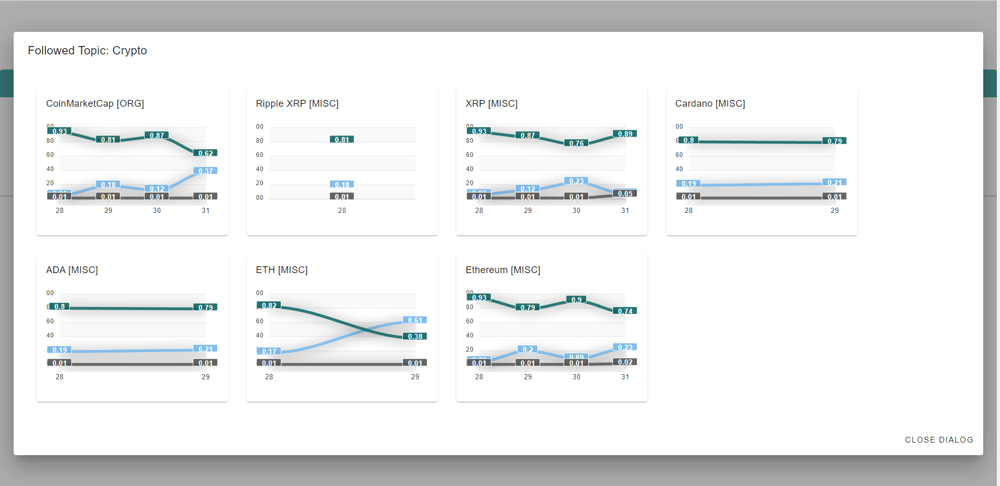

# INSPECT 
INSPECT is a sentiment and NER extraction tool!

New Features:
* completely new backend
* Mysql got replaced by MongoDB,
    * because of the high amount of json data
    * fast computations via aggregations pipelines
* Followed Topics are now tracked separately 

Requirements: MongoDB, Huggingface account,  

Note: you need to specifiy your datasource, huggingface_token and credetials in the application.properties

### Features

#### EMOTION FILTER
filter article by emotions

#### SENTIMENT BY DAY
track the overall sentiment by day

#### NER
extract important locations, persons, organisations and misc 

#### FOLLOW TOPIC
cluster multiple topics to one umbrella term and track the sentiment over time

