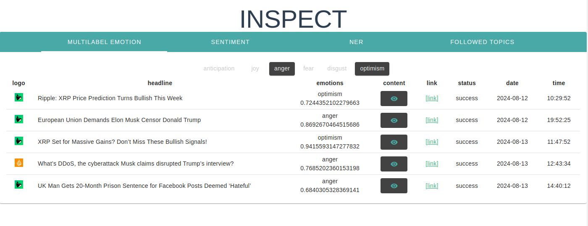

# inspect-public (POC)
INSPECT is a sentiment and NER extraction tool!

### Preliminary remarks
1) inspect is designed for single user only, therefore the inputs are not validated
2) if you want to deploy on a publicly accessible machine use prod mode, which protects your system with basic auth
3) all webscrapper have been removed for legal reasons 
4) this is a proof of concept and under full development

requirements: mysql_db, huggingface account,  

note: you need to specifiy your datasource, huggingface_token and credetials in the application.properties

### Features

#### EMOTION FILTER
filter article by emotions

#### SENTIMENT BY DAY
track the overall sentiment by day

#### NER
extract important locations, persons, organisations and misc 

#### FOLLOW TOPIC
cluster multiple topics to one umbrella term and track the sentiment over time

